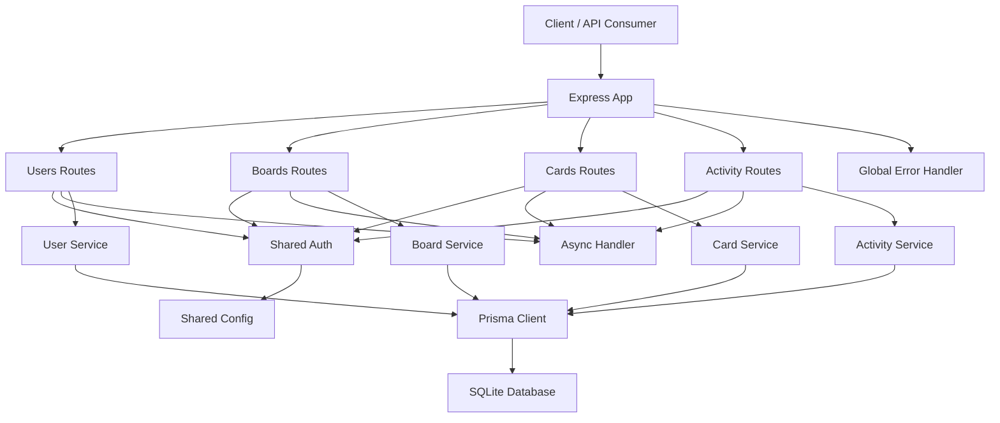

# System Diagram

Date: 2026-04-10
Status: Current architecture after the first hardening pass.

## Overview

The following diagram shows the main runtime structure of the application and the current separation between HTTP routes, shared infrastructure, services, Prisma, and SQLite.

## Notes

- Route handlers are now thin and delegate use-case logic to services.
- Auth, config, async wrapping, and error handling are shared cross-cutting infrastructure.
- Services still depend directly on Prisma; repository extraction is a future step.
- Activity events are persisted explicitly and are read back through the activity service.
