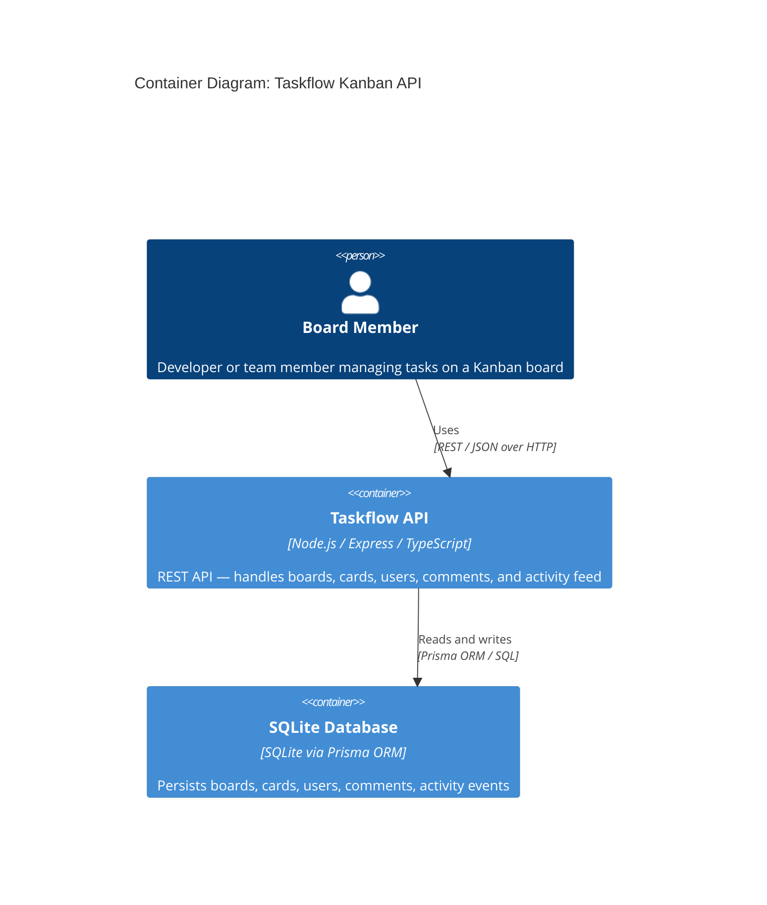

# Container Diagram — Taskflow Kanban API

```mermaid
C4Container
    title Container Diagram: Taskflow Kanban API

    Person(member, "Board Member", "Developer or team member managing tasks on a Kanban board")

    Container(api, "Taskflow API", "Node.js / Express / TypeScript", "REST API — handles boards, cards, users, comments, and activity feed")
    Container(db, "SQLite Database", "SQLite via Prisma ORM", "Persists boards, cards, users, comments, activity events")

    Rel(member, api, "Uses", "REST / JSON over HTTP")
    Rel(api, db, "Reads and writes", "Prisma ORM / SQL")
```