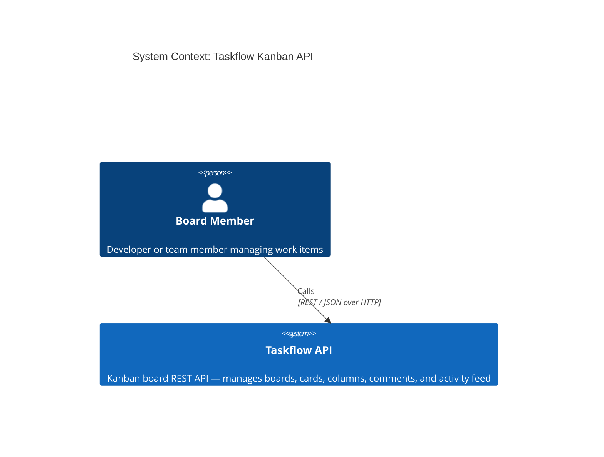

# Context Diagram — Taskflow Kanban API

```mermaid
C4Context
    title System Context: Taskflow Kanban API

    Person(member, "Board Member", "Developer or team member managing work items")

    System(taskflow, "Taskflow API", "Kanban board REST API — manages boards, cards, columns, comments, and activity feed")

    Rel(member, taskflow, "Calls", "REST / JSON over HTTP")
```