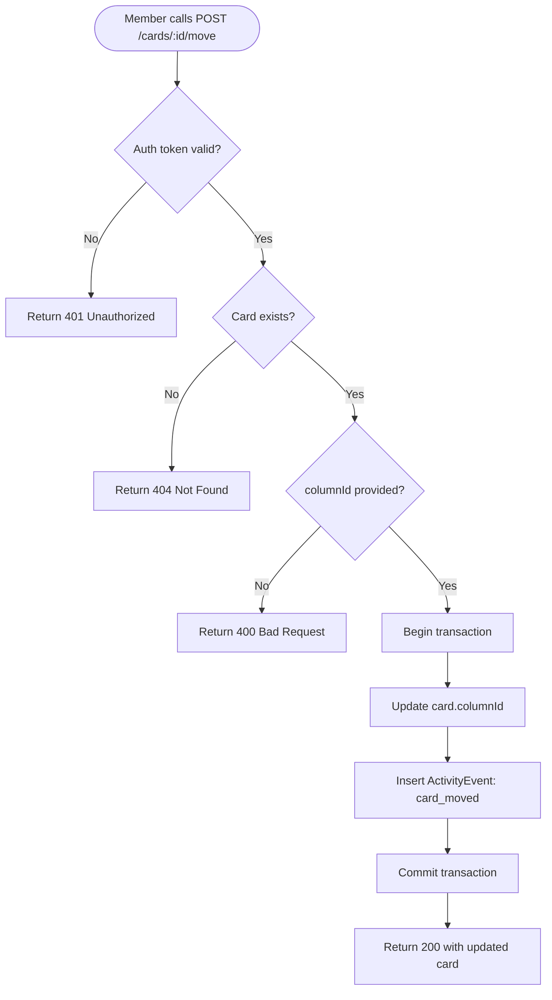

# Flow: Card Move with Activity Recording

```mermaid
flowchart TD
    Start([Member calls POST /cards/:id/move])
    Start --> Auth{Auth token valid?}
    Auth -->|No| Err401[Return 401 Unauthorized]
    Auth -->|Yes| FindCard{Card exists?}
    FindCard -->|No| Err404[Return 404 Not Found]
    FindCard -->|Yes| Validate{columnId provided?}
    Validate -->|No| Err400[Return 400 Bad Request]
    Validate -->|Yes| Txn[Begin transaction]
    Txn --> MoveCard[Update card.columnId]
    MoveCard --> WriteEvent[Insert ActivityEvent: card_moved]
    WriteEvent --> Commit[Commit transaction]
    Commit --> Return200[Return 200 with updated card]
```