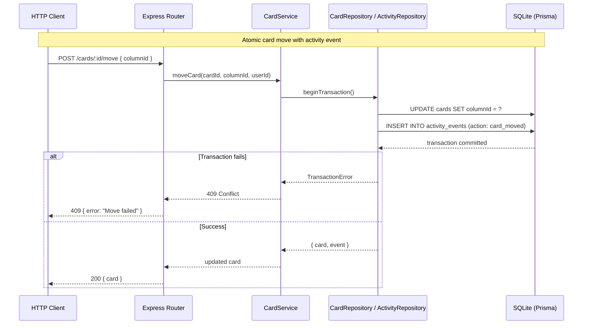

# Sequence Diagram: Move Card and Record Activity

```mermaid
sequenceDiagram
    participant Client as HTTP Client
    participant API as Express Router
    participant Service as CardService
    participant Repo as CardRepository / ActivityRepository
    participant DB as SQLite (Prisma)

    Note over Client,DB: Atomic card move with activity event

    Client->>API: POST /cards/:id/move { columnId }
    API->>Service: moveCard(cardId, columnId, userId)
    Service->>Repo: beginTransaction()
    Repo->>DB: UPDATE cards SET columnId = ?
    Repo->>DB: INSERT INTO activity_events (action: card_moved)
    DB-->>Repo: transaction committed

    alt Transaction fails
        Repo-->>Service: TransactionError
        Service-->>API: 409 Conflict
        API-->>Client: 409 { error: "Move failed" }
    else Success
        Repo-->>Service: { card, event }
        Service-->>API: updated card
        API-->>Client: 200 { card }
    end
```