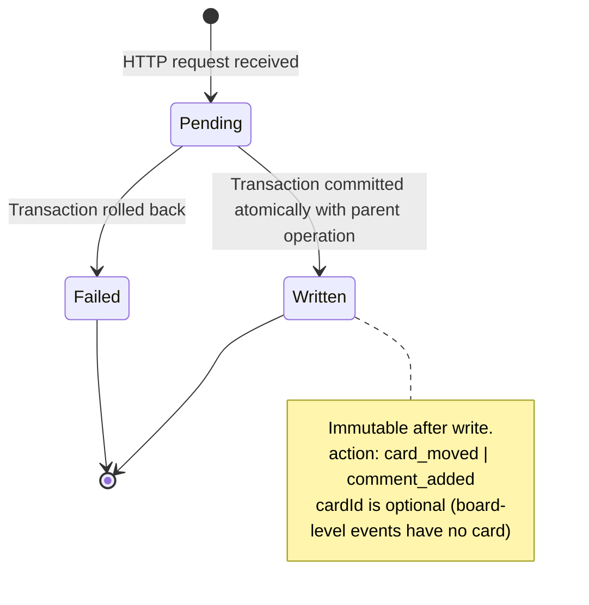

# State Machine: ActivityEvent

```mermaid
stateDiagram-v2
    [*] --> Pending: HTTP request received

    Pending --> Written: Transaction committed atomically with parent operation
    Pending --> Failed: Transaction rolled back

    Written --> [*]
    Failed --> [*]

    note right of Written
        Immutable after write.
        action: card_moved | comment_added
        cardId is optional (board-level events have no card)
    end note
```